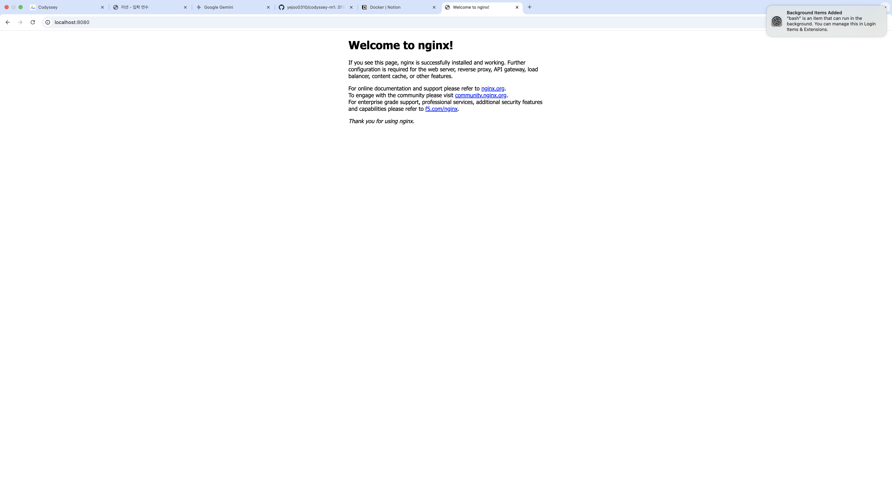
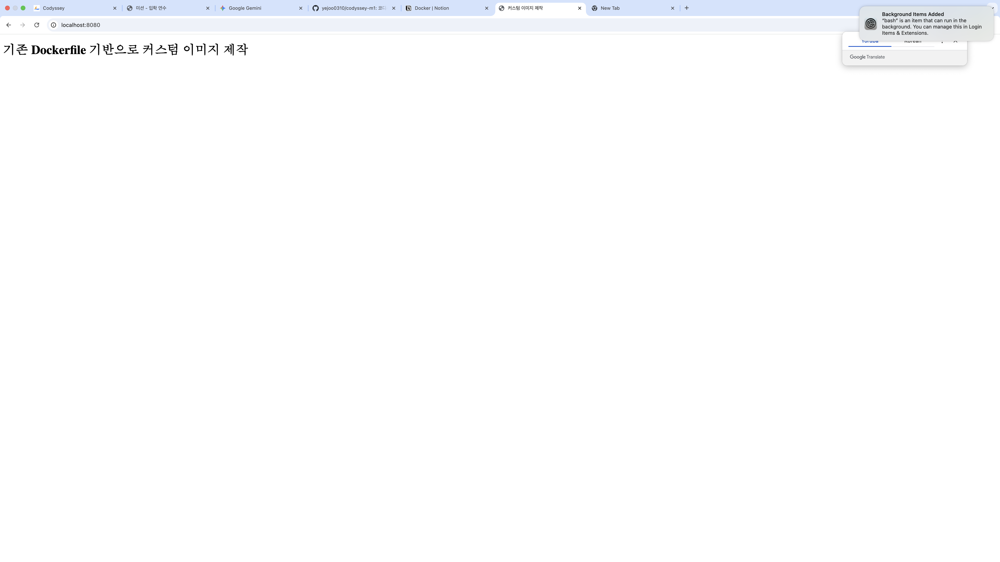
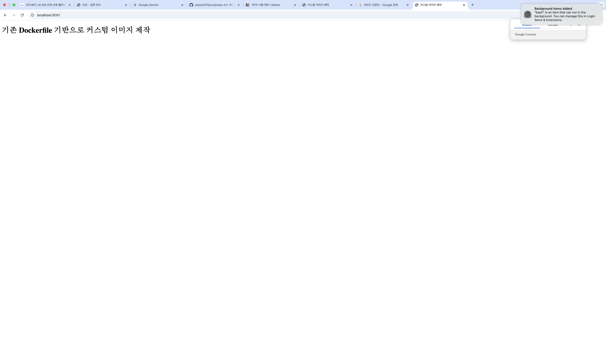
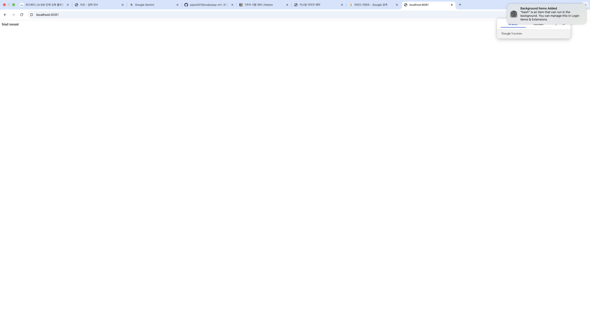
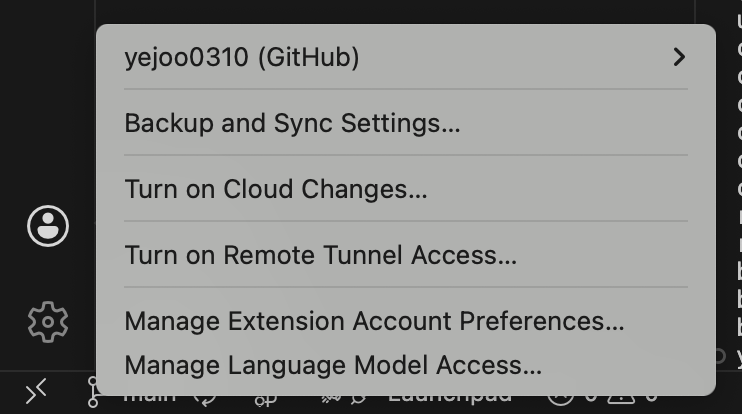

# codyssey-m1
코디세이 AI 올인원 입학연수과정 미션1

### 1. 프로젝트 개요
이 프로젝트의 목표는 터미널, Docker, Git/GitHub를 활용하여 재현 가능한 개발 워크스테이션 환경을 구성하고, 그 과정을 문서로 정리하는 것이다. 터미널을 이용해 작업 디렉토리와 권한을 부여하고, Docker를 설치 및 점검한 뒤 컨테이너를 실행 및 관리한다. 또한 Dockerfile을 기반으로 간단한 웹 서버 이미지를 제작하고, 포트 매핑으로 접속을 확인하며 바인드 마운트와 볼륨을 사용해 변경 반영과 데이터 영속성을 확인한다.

### 2. 실행 환경
- OS: macOS
- Shell: bash
- Docker: 28.3.2
- Git: 2.45.2

### 3. 수행 항목 체크리스트
- [x] 터미널 기본 조작 및 폴더 구성
- [x] 권한 변경 실습
- [x] Docker 설치/점검
- [x] hello-world 실행
- [x] ubuntu 실행
- [x] attach, exec 차이 실습
- [x] 기존 Dockerfile 기반 커스텀 이미지 제작
- [x] 포트 매핑 접속
- [x] 바인드 마운트 반영
- [x] 볼륨 영속성
- [x] Git 설정 + VSCode GitHub 연동
- [x] 트러블슈팅 정리

### 4. 터미널 조작 로그 기록

#### 1) 현재 위치 확인
현재 작업 중인 디렉토리의 절대 경로를 확인할 수 있음
```
➜  codyssey-m1 git:(main) pwd
/Users/kim-yejoo/Codyssey-2026/codyssey-m1
```
절대 경로와 상대 경로의 차이
- 파일의 위치를 찾을 때 기준점이 어디냐에 따라 절대 경로와 상대 경로가 구분됨
- 절대 경로는 파일 시스템의 루트부터 시작해서 특정 파일이나 디렉토리에 도달하는 전체 경로로 어디서 실행하든 항상 같은 파일을 가리킨다. 어느 곳에서든 경로에 접근할 수 있다는 장점이 있지만 경로가 변경되면 경로를 일일히 수정해야 한다는 불편함이 있다.
- 상대 경로는 현재 내가 위치한 디렉토리를 기준으로 파일 위치를 표현한다. 디렉토리 위치나 주소가 바뀌어도 내부 구조만 그대로라면 수정없이 그대로 사용할 수 있다는 장점이 있다.
- 절대 경로는 외부 파일을 참조할 때 주로 사용하고, 상대 경로는 내부 파일을 연결할 때 주로 사용한다.

#### 2) 목록 확인(숨김 파일 포함)
현재 위치나 특정 디렉토리의 리스트를 출력
```
➜  codyssey-m1 git:(main) ✗ ls -alh
total 8
drwxr-xr-x   4 kim-yejoo  staff   128B Mar 31 17:24 .
drwxr-xr-x   3 kim-yejoo  staff    96B Mar 31 17:24 ..
drwxr-xr-x  13 kim-yejoo  staff   416B Apr  1 09:16 .git
-rw-r--r--   1 kim-yejoo  staff   1.5K Apr  1 09:26 README.md
```
```
➜  codyssey-m1 git:(main) ✗ ls -alh ../
total 0
drwxr-xr-x    3 kim-yejoo  staff    96B Mar 31 17:24 .
drwxr-x---+ 110 kim-yejoo  staff   3.4K Apr  1 10:18 ..
drwxr-xr-x    6 kim-yejoo  staff   192B Apr  1 09:41 codyssey-m1
```
옵션
- `-a`: all의 줄임말로, 숨김 파일 및 디렉토리를 포함한 모든 파일을 출력
- `-l`: long의 줄임말로, 파일 출력 형식을 긴 목록 형식으로 출력 (파일 타입, 권한, 소유자, 그룹, 파일 크기, 수정시간 등)
 - `-h`: human의 줄임말로, 사용자가 보기 좋은 형태의 단위로 출력
  
#### 3) 이동
현재 작업 중인 디렉토리 위치를 변경
```
➜  codyssey-m1 git:(main) ✗ pwd
/Users/kim-yejoo/Codyssey-2026/codyssey-m1
➜  codyssey-m1 git:(main) ✗ cd ..
➜  Codyssey-2026 git:(master) ✗ pwd
/Users/kim-yejoo/Codyssey-2026
```

#### 4) 디렉토리 생성
```
➜  codyssey-m1 git:(main) ✗ ls -a
.         ..        .git      README.md
➜  codyssey-m1 git:(main) ✗ mkdir test-dir
➜  codyssey-m1 git:(main) ✗ ls -a
.         ..        .git      README.md test-dir
```
```
➜  codyssey-m1 git:(main) ✗ ls
README.md test-dir  test.txt
➜  codyssey-m1 git:(main) ✗ mkdir ../codyssey-m1/text2-dir
➜  codyssey-m1 git:(main) ✗ ls
README.md test-dir  test.txt  text2-dir
```

#### 5) 파일 생성
```
➜  codyssey-m1 git:(main) ✗ ls -a 
.         ..        .git      README.md test-dir
➜  codyssey-m1 git:(main) ✗ touch test.txt
➜  codyssey-m1 git:(main) ✗ ls -a
.         ..        .git      README.md test-dir  test.txt
```

#### 6) 파일 내용 확인
```
➜  codyssey-m1 git:(main) ✗ cat test.txt 
➜  codyssey-m1 git:(main) ✗ 
```

#### 7) 파일에 내용 작성
```
➜  codyssey-m1 git:(main) ✗ cat test.txt 
➜  codyssey-m1 git:(main) ✗ echo "test file" > test.txt
➜  codyssey-m1 git:(main) ✗ cat test.txt
test file
```

#### 8) 파일 복사
```
➜  codyssey-m1 git:(main) ✗ ls
README.md test-dir  test.txt  text2-dir
➜  codyssey-m1 git:(main) ✗ cp test.txt copy.txt
➜  codyssey-m1 git:(main) ✗ ls
copy.txt  README.md test-dir  test.txt  text2-dir
➜  codyssey-m1 git:(main) ✗ cat copy.txt 
test file
```

#### 9) 디렉토리 복사
```
➜  Codyssey-2026 git:(master) ✗ cp -r codyssey-m1 copy-dir
➜  Codyssey-2026 git:(master) ✗ ls
codyssey-m1 copy-dir
➜  Codyssey-2026 git:(master) ✗ cd copy-dir 
➜  copy-dir git:(main) ✗ ls
copy.txt  README.md test-dir  test.txt  text2-dir
```

#### 10) 파일 이동
파일, 디렉토리 이동과 이름 변경 시 모두 `mv` 명령어 사용

파일 이동: `mv [파일명] [이동할 디렉토리 경로]`
```
➜  codyssey-m1 git:(main) ✗ touch moving.txt
➜  codyssey-m1 git:(main) ✗ mv moving.txt ../copy-dir 
➜  codyssey-m1 git:(main) ✗ ls
copy.txt  README.md test-dir  test.txt  text2-dir
➜  codyssey-m1 git:(main) ✗ cd ../copy-dir/ 
➜  copy-dir git:(main) ✗ ls
copy.txt   moving.txt README.md  test-dir   test.txt   text2-dir
```

#### 11) 파일 이름 변경
파일 이름 변경: `mv [기존 파일명] [새로운 파일명]`
```
➜  copy-dir git:(main) ✗ ls
copy.txt   moving.txt README.md  test-dir   test.txt   text2-dir
➜  copy-dir git:(main) ✗ mv moving.txt new.txt
➜  copy-dir git:(main) ✗ ls
copy.txt  new.txt   README.md test-dir  test.txt  text2-dir
```

#### 12) 디렉토리 이동
디렉토리 이동: `mv [디렉토리명] [목적지]`
```
➜  copy-dir git:(main) ✗ mkdir moving-dir
➜  copy-dir git:(main) ✗ mv moving-dir ../codyssey-m1 
➜  copy-dir git:(main) ✗ cd ../codyssey-m1 
➜  codyssey-m1 git:(main) ✗ ls
copy.txt   moving-dir README.md  test-dir   test.txt   text2-dir
```

#### 13) 디렉토리 이름 변경
디렉토리 이름 변경: `mv [기존 디렉토리명] [새로운 디렉토리명]`
```
➜  codyssey-m1 git:(main) ✗ ls
copy.txt   moving-dir README.md  test-dir   test.txt   text2-dir
➜  codyssey-m1 git:(main) ✗ mv moving-dir new-dir
➜  codyssey-m1 git:(main) ✗ ls
copy.txt  new-dir   README.md test-dir  test.txt  text2-dir
```

#### 14) 파일 삭제
```
➜  codyssey-m1 git:(main) ✗ ls
copy.txt  new-dir   README.md test-dir  test.txt  text2-dir
➜  codyssey-m1 git:(main) ✗ rm test.txt copy.txt 
➜  codyssey-m1 git:(main) ✗ ls
new-dir   README.md test-dir  text2-dir
```

#### 15) 디렉토리 삭제
빈 디렉토리 삭제: `rmdir [디렉토리명]`, `rm -d [디렉토리명]`
```
➜  codyssey-m1 git:(main) ✗ ls
new-dir   README.md test-dir  text2-dir
➜  codyssey-m1 git:(main) ✗ rmdir new-dir
➜  codyssey-m1 git:(main) ✗ rm -d test-dir text2-dir
➜  codyssey-m1 git:(main) ✗ ls
README.md
```
디렉토리 및 전체 내용 삭제: `rm -r [디렉토리명]`, `rm -rf [디렉토리명]`
```
➜  Codyssey-2026 git:(master) ✗ ls
codyssey-m1 copy-dir
➜  Codyssey-2026 git:(master) ✗ rm -rf copy-dir 
➜  Codyssey-2026 git:(master) ✗ ls
codyssey-m1
```
### 5. 권한 실습 및 로그 기록

#### 1) 실습 대상 생성
```
➜  codyssey-m1 git:(main) ✗ mkdir permission-dir
➜  codyssey-m1 git:(main) ✗ touch permission.txt
```

#### 2) 변경 전 권한 확인 및 기본 설정
```
➜  codyssey-m1 git:(main) ✗ ls -l
total 16
drwxr-xr-x  2 kim-yejoo  staff    64 Apr  1 15:16 permission-dir
-rw-r--r--  1 kim-yejoo  staff  7525 Apr  1 15:15 README.md
-rw-r--r--  1 kim-yejoo  staff     0 Apr  1 15:16 script.sh
```
```
➜  codyssey-m1 git:(main) ✗ echo "echo hello" > script.sh
```
```
➜  codyssey-m1 git:(main) ✗ cd permission-dir 
➜  permission-dir git:(main) ✗ touch permission.txt
➜  permission-dir git:(main) ✗ ls
permission.txt
```

#### 3) 파일 권한 변경
파일 권한을 기존 644에서 744로 변경하니 파일 실행이 가능하였다.
- 변경 전 파일 실행 시도
- 파일 실행 권한이 제한되어서 실행되지 않았다.
```
➜  codyssey-m1 git:(main) ✗ ./script.sh
zsh: permission denied: ./script.sh
```

- 파일 권한을 744로 변경하니 해당 파일이 실행되어 `hello`가 출력되었다.
```
➜  codyssey-m1 git:(main) ✗ chmod 744 script.sh
➜  codyssey-m1 git:(main) ✗ ls -l script.sh
-rwxr--r--  1 kim-yejoo  staff  11 Apr  1 15:18 script.sh
➜  codyssey-m1 git:(main) ✗ ./script.sh
hello
```

#### 4) 디렉토리 권한 변경
디렉토리 권한을 기존 755에서 655로 변경하니
- 변경 전 디렉토리 이동 및 리스트 확인
```
➜  codyssey-m1 git:(main) ✗ cd permission-dir 
➜  permission-dir git:(main) ✗ ls
permission.txt
```
- 변경 후 해당 디렉토리로 이동을 시도했으나 `x` 권한이 제한되어서 해당 디렉토리로 전환이 불가하였다.
```
➜  codyssey-m1 git:(main) ✗ chmod 655 permission-dir 
➜  codyssey-m1 git:(main) ✗ cd permission-dir 
cd: permission denied: permission-dir
```

### 6. Docker 설치 및 기본 점검
#### 1) Docker 버전 확인
```
yejoo031053822@c3r8s5 ~ % docker --version
Docker version 28.5.2, build ecc6942
```

#### 2) Docker 데몬 동작 여부 확인
```
yejoo031053822@c3r8s5 ~ % docker info
Client:
 Version:    28.5.2
 Context:    orbstack
 Debug Mode: false
 Plugins:
  buildx: Docker Buildx (Docker Inc.)
    Version:  v0.29.1
    Path:     /Users/yejoo031053822/.docker/cli-plugins/docker-buildx
  compose: Docker Compose (Docker Inc.)
    Version:  v2.40.3
    Path:     /Users/yejoo031053822/.docker/cli-plugins/docker-compose

Server:
 Containers: 0
  Running: 0
  Paused: 0
  Stopped: 0
 Images: 0
 Server Version: 28.5.2
 Storage Driver: overlay2
  Backing Filesystem: btrfs
  Supports d_type: true
  Using metacopy: false
  Native Overlay Diff: true
  userxattr: false
 Logging Driver: json-file
 Cgroup Driver: cgroupfs
 Cgroup Version: 2
 Plugins:
  Volume: local
  Network: bridge host ipvlan macvlan null overlay
  Log: awslogs fluentd gcplogs gelf journald json-file local splunk syslog
 CDI spec directories:
  /etc/cdi
  /var/run/cdi
 Swarm: inactive
 Runtimes: io.containerd.runc.v2 runc
 Default Runtime: runc
 Init Binary: docker-init
 containerd version: 1c4457e00facac03ce1d75f7b6777a7a851e5c41
 runc version: d842d7719497cc3b774fd71620278ac9e17710e0
 init version: de40ad0
 Security Options:
  seccomp
   Profile: builtin
  cgroupns
 Kernel Version: 6.17.8-orbstack-00308-g8f9c941121b1
 Operating System: OrbStack
 OSType: linux
 Architecture: x86_64
 CPUs: 6
 Total Memory: 15.67GiB
 Name: orbstack
 ID: 8c335266-ae88-4e48-8262-bea08f970e06
 Docker Root Dir: /var/lib/docker
 Debug Mode: false
 Experimental: false
 Insecure Registries:
  ::1/128
  127.0.0.0/8
 Live Restore Enabled: false
 Product License: Community Engine
 Default Address Pools:
   Base: 192.168.97.0/24, Size: 24
   Base: 192.168.107.0/24, Size: 24
   Base: 192.168.117.0/24, Size: 24
   Base: 192.168.147.0/24, Size: 24
   Base: 192.168.148.0/24, Size: 24
   Base: 192.168.155.0/24, Size: 24
   Base: 192.168.156.0/24, Size: 24
   Base: 192.168.158.0/24, Size: 24
   Base: 192.168.163.0/24, Size: 24
   Base: 192.168.164.0/24, Size: 24
   Base: 192.168.165.0/24, Size: 24
   Base: 192.168.166.0/24, Size: 24
   Base: 192.168.167.0/24, Size: 24
   Base: 192.168.171.0/24, Size: 24
   Base: 192.168.172.0/24, Size: 24
   Base: 192.168.181.0/24, Size: 24
   Base: 192.168.183.0/24, Size: 24
   Base: 192.168.186.0/24, Size: 24
   Base: 192.168.207.0/24, Size: 24
   Base: 192.168.214.0/24, Size: 24
   Base: 192.168.215.0/24, Size: 24
   Base: 192.168.216.0/24, Size: 24
   Base: 192.168.223.0/24, Size: 24
   Base: 192.168.227.0/24, Size: 24
   Base: 192.168.228.0/24, Size: 24
   Base: 192.168.229.0/24, Size: 24
   Base: 192.168.237.0/24, Size: 24
   Base: 192.168.239.0/24, Size: 24
   Base: 192.168.242.0/24, Size: 24
   Base: 192.168.247.0/24, Size: 24
   Base: fd07:b51a:cc66:d000::/56, Size: 64

WARNING: DOCKER_INSECURE_NO_IPTABLES_RAW is set
```

### 7. Docker 기본 운영 명령 수행
#### 1) 이미지 다운로드
```
yejoo031053822@c3r8s5 ~ % docker pull nginx
Using default tag: latest
latest: Pulling from library/nginx
ec781dee3f47: Pull complete 
bb3d0aa29654: Pull complete 
510ddf6557d6: Pull complete 
cde7a05ae428: Pull complete 
587e3d84dbb5: Pull complete 
3189680c601f: Pull complete 
5e815e07e569: Pull complete 
Digest: sha256:7150b3a39203cb5bee612ff4a9d18774f8c7caf6399d6e8985e97e28eb751c18
Status: Downloaded newer image for nginx:latest
docker.io/library/nginx:latest
yejoo031053822@c3r8s5 ~ % docker images
REPOSITORY   TAG       IMAGE ID       CREATED      SIZE
nginx        latest    0cf1d6af5ca7   8 days ago   161MB
```

#### 2) 이미지 목록 확인
```
yejoo031053822@c3r8s5 ~ % docker images
REPOSITORY   TAG       IMAGE ID       CREATED      SIZE
nginx        latest    0cf1d6af5ca7   8 days ago   161MB
```

#### 3) 컨테이너 실행
```
yejoo031053822@c3r8s5 ~ % docker run -d --name web-test1 -p 8080:80 nginx
57ef289ce65cac2730e9f31bbf0742e297bf84869ed1e498ca43a12cccd15722
```
포트 매핑이 필요한 이유
- 도커 컨테이너는 독립된 네트워크 공간을 가져서 포트 매핑을 하지 않으면 외부에서 접근이 불가능하고 컨테이너는 혼자서만 통신할 수 있다. 웹 서버를 띄운 이유는 외부에서 접속하기 위해서이므로 포트 매핑을 함으로써 컨테이너가 외부로 통하는 창구를 만들어줄 수 있다.
- `-p 8080:80` : 내 컴퓨터의 `8080`번 포트로 들어오는 모든 신호를 컨테이너 내부의 `80`번 포트로 전달하라는 뜻. 사용자가 브라우저에 `localhost:8080`을 치면 이 접속 요청을 컨테이너 `80`번 포트로 보내고, 컨테이너는 자신의 파일 시스템에 있는 `index.html` 데이터를 읽어서 `80`번 포트로 내보낸다. 도커 엔진이 이 데이터를 받아서 내 컴퓨터의 `8080`번 포트로 내보내면 브라우저를 통해 nginx 화면이 우리 눈에 보이게 된다.

#### 4) 실행 중인 컨테이너 목록 확인
```
yejoo031053822@c3r8s5 ~ % docker ps
CONTAINER ID   IMAGE     COMMAND                  CREATED              STATUS              PORTS                                     NAMES
57ef289ce65c   nginx     "/docker-entrypoint.…"   About a minute ago   Up About a minute   0.0.0.0:8080->80/tcp, [::]:8080->80/tcp   web-test1
```

#### 5) 컨테이너 중지
```
yejoo031053822@c3r8s5 ~ % docker stop web-test1
web-test1
```

#### 6) 컨테이너 목록 확인
```
yejoo031053822@c3r8s5 ~ % docker ps -a
CONTAINER ID   IMAGE     COMMAND                  CREATED         STATUS                      PORTS     NAMES
57ef289ce65c   nginx     "/docker-entrypoint.…"   2 minutes ago   Exited (0) 16 seconds ago             web-test1
```

#### 7) 컨테이너 로그 확인
```
yejoo031053822@c3r8s5 ~ % docker logs web-test1
/docker-entrypoint.sh: /docker-entrypoint.d/ is not empty, will attempt to perform configuration
/docker-entrypoint.sh: Looking for shell scripts in /docker-entrypoint.d/
/docker-entrypoint.sh: Launching /docker-entrypoint.d/10-listen-on-ipv6-by-default.sh
10-listen-on-ipv6-by-default.sh: info: Getting the checksum of /etc/nginx/conf.d/default.conf
10-listen-on-ipv6-by-default.sh: info: Enabled listen on IPv6 in /etc/nginx/conf.d/default.conf
/docker-entrypoint.sh: Sourcing /docker-entrypoint.d/15-local-resolvers.envsh
/docker-entrypoint.sh: Launching /docker-entrypoint.d/20-envsubst-on-templates.sh
/docker-entrypoint.sh: Launching /docker-entrypoint.d/30-tune-worker-processes.sh
/docker-entrypoint.sh: Configuration complete; ready for start up
2026/04/02 12:08:04 [notice] 1#1: using the "epoll" event method
2026/04/02 12:08:04 [notice] 1#1: nginx/1.29.7
2026/04/02 12:08:04 [notice] 1#1: built by gcc 14.2.0 (Debian 14.2.0-19) 
2026/04/02 12:08:04 [notice] 1#1: OS: Linux 6.17.8-orbstack-00308-g8f9c941121b1
2026/04/02 12:08:04 [notice] 1#1: getrlimit(RLIMIT_NOFILE): 20480:1048576
2026/04/02 12:08:04 [notice] 1#1: start worker processes
2026/04/02 12:08:04 [notice] 1#1: start worker process 29
2026/04/02 12:08:04 [notice] 1#1: start worker process 30
2026/04/02 12:08:04 [notice] 1#1: start worker process 31
2026/04/02 12:08:04 [notice] 1#1: start worker process 32
2026/04/02 12:08:04 [notice] 1#1: start worker process 33
2026/04/02 12:08:04 [notice] 1#1: start worker process 34
2026/04/02 12:10:16 [notice] 1#1: signal 3 (SIGQUIT) received, shutting down
2026/04/02 12:10:16 [notice] 29#29: gracefully shutting down
2026/04/02 12:10:16 [notice] 29#29: exiting
2026/04/02 12:10:16 [notice] 29#29: exit
2026/04/02 12:10:16 [notice] 33#33: gracefully shutting down
2026/04/02 12:10:16 [notice] 33#33: exiting
2026/04/02 12:10:16 [notice] 30#30: gracefully shutting down
2026/04/02 12:10:16 [notice] 30#30: exiting
2026/04/02 12:10:16 [notice] 33#33: exit
2026/04/02 12:10:16 [notice] 30#30: exit
2026/04/02 12:10:16 [notice] 31#31: gracefully shutting down
2026/04/02 12:10:16 [notice] 31#31: exiting
2026/04/02 12:10:16 [notice] 31#31: exit
2026/04/02 12:10:16 [notice] 32#32: gracefully shutting down
2026/04/02 12:10:16 [notice] 32#32: exiting
2026/04/02 12:10:16 [notice] 34#34: gracefully shutting down
2026/04/02 12:10:16 [notice] 34#34: exiting
2026/04/02 12:10:16 [notice] 34#34: exit
2026/04/02 12:10:16 [notice] 32#32: exit
2026/04/02 12:10:17 [notice] 1#1: signal 17 (SIGCHLD) received from 29
2026/04/02 12:10:17 [notice] 1#1: worker process 29 exited with code 0
2026/04/02 12:10:17 [notice] 1#1: signal 29 (SIGIO) received
2026/04/02 12:10:17 [notice] 1#1: signal 17 (SIGCHLD) received from 32
2026/04/02 12:10:17 [notice] 1#1: worker process 32 exited with code 0
2026/04/02 12:10:17 [notice] 1#1: worker process 34 exited with code 0
2026/04/02 12:10:17 [notice] 1#1: signal 29 (SIGIO) received
2026/04/02 12:10:17 [notice] 1#1: signal 17 (SIGCHLD) received from 30
2026/04/02 12:10:17 [notice] 1#1: worker process 30 exited with code 0
2026/04/02 12:10:17 [notice] 1#1: signal 17 (SIGCHLD) received from 33
2026/04/02 12:10:17 [notice] 1#1: worker process 31 exited with code 0
2026/04/02 12:10:17 [notice] 1#1: worker process 33 exited with code 0
2026/04/02 12:10:17 [notice] 1#1: exit
```

#### 8) 리소스 확인
```
yejoo031053822@c3r8s5 ~ % docker stats --no-stream
CONTAINER ID   NAME        CPU %     MEM USAGE / LIMIT    MEM %     NET I/O         BLOCK I/O        PIDS
57ef289ce65c   web-test1   0.00%     9.75MiB / 15.67GiB   0.06%     1.13kB / 126B   16.1MB / 4.1kB   7
```

### 8. 컨테이너 실행 실습
#### 1) `hello-world` 실행
```
yejoo031053822@c3r8s5 ~ % docker run hello-world
Unable to find image 'hello-world:latest' locally
latest: Pulling from library/hello-world
4f55086f7dd0: Pull complete 
Digest: sha256:452a468a4bf985040037cb6d5392410206e47db9bf5b7278d281f94d1c2d0931
Status: Downloaded newer image for hello-world:latest

Hello from Docker!
This message shows that your installation appears to be working correctly.

To generate this message, Docker took the following steps:
 1. The Docker client contacted the Docker daemon.
 2. The Docker daemon pulled the "hello-world" image from the Docker Hub.
    (amd64)
 3. The Docker daemon created a new container from that image which runs the
    executable that produces the output you are currently reading.
 4. The Docker daemon streamed that output to the Docker client, which sent it
    to your terminal.

To try something more ambitious, you can run an Ubuntu container with:
 $ docker run -it ubuntu bash

Share images, automate workflows, and more with a free Docker ID:
 https://hub.docker.com/

For more examples and ideas, visit:
 https://docs.docker.com/get-started/

yejoo031053822@c3r8s5 ~ % 
```

#### 2) `ubuntu` 컨테이너 실행
```
yejoo031053822@c3r8s5 ~ % docker run -it ubuntu bash
Unable to find image 'ubuntu:latest' locally
latest: Pulling from library/ubuntu
817807f3c64e: Pull complete 
Digest: sha256:186072bba1b2f436cbb91ef2567abca677337cfc786c86e107d25b7072feef0c
Status: Downloaded newer image for ubuntu:latest
root@8cae1bf51e2d:/#
```

#### 3) `ubuntu` 컨테이너 진입 후 간단 명령 실행
파일 목록을 확인
```
root@8cae1bf51e2d:/# ls
bin   dev  home  lib64  mnt  proc  run   srv  tmp  var
boot  etc  lib   media  opt  root  sbin  sys  usr
```

`test.txt` 파일을 생성하고 "hello"를 입력하고 파일 내용 확인
```
root@8cae1bf51e2d:/# touch test.txt
root@8cae1bf51e2d:/# echo "hello" > test.txt
root@8cae1bf51e2d:/# cat test.txt 
hello
root@8cae1bf51e2d:/# ls
bin   dev  home  lib64  mnt  proc  run   srv  test.txt  usr
boot  etc  lib   media  opt  root  sbin  sys  tmp       var
```

#### 4) 컨테이너 종료/유지 실습
`exec` 
```
yejoo031053822@c3r8s5 ~ % docker exec -it ubuntu-test1 /bin/bash
root@b3e1d0685423:/# ls
bin  boot  dev  etc  home  lib  lib64  media  mnt  opt  proc  root  run  sbin  srv  sys  tmp  usr  var
root@b3e1d0685423:/# pwd
/
root@b3e1d0685423:/# exit
exit
yejoo031053822@c3r8s5 ~ % docker ps
CONTAINER ID   IMAGE     COMMAND       CREATED          STATUS          PORTS     NAMES
b3e1d0685423   ubuntu    "/bin/bash"   25 minutes ago   Up 25 minutes             ubuntu-test1
```

`attach`
```
yejoo031053822@c3r8s5 ~ % docker attach ubuntu-test1
root@b3e1d0685423:/# ls
bin  boot  dev  etc  home  lib  lib64  media  mnt  opt  proc  root  run  sbin  srv  sys  tmp  usr  var
root@b3e1d0685423:/# pwd
/
root@b3e1d0685423:/# exit
exit
yejoo031053822@c3r8s5 ~ % docker ps -a
CONTAINER ID   IMAGE         COMMAND                  CREATED             STATUS                         PORTS     NAMES
b3e1d0685423   ubuntu        "/bin/bash"              26 minutes ago      Exited (0) 3 seconds ago                 ubuntu-test1
18b4e5d04f04   ubuntu        "/bin/bash"              About an hour ago   Exited (0) About an hour ago             cranky_yonath
8cae1bf51e2d   ubuntu        "bash"                   22 hours ago        Exited (137) 21 hours ago                sharp_albattani
0c3b30157c99   hello-world   "/hello"                 22 hours ago        Exited (0) 22 hours ago                  distracted_matsumoto
57ef289ce65c   nginx         "/docker-entrypoint.…"   23 hours ago        Exited (0) 21 hours ago                  web-test1
yejoo031053822@c3r8s5 ~ % 
```

### 9. 기존 Dockerfile 기반 커스텀 이미지 제작
#### 1) 커스텀 전 기본 nginx 페이지 실행
```
yejoo031053822@c3r8s5 ~ % docker run -d -p 8080:80 --name first-nginx nginx 
05756d093a7d2044a23eecf3535ddb6fae487abd77510d8b1c792d44dc18f201
yejoo031053822@c3r8s5 ~ % 
```


#### 2) 커스텀 이미지 빌드
```
yejoo031053822@c3r8s5 app % docker build -t my-web .
[+] Building 0.9s (7/7) FINISHED                                                                                                                                                                                                                            docker:orbstack
 => [internal] load build definition from Dockerfile                                                                                                                                                                                                                   0.1s
 => => transferring dockerfile: 113B                                                                                                                                                                                                                                   0.0s
 => [internal] load metadata for docker.io/library/nginx:latest                                                                                                                                                                                                        0.0s
 => [internal] load .dockerignore                                                                                                                                                                                                                                      0.1s
 => => transferring context: 2B                                                                                                                                                                                                                                        0.0s
 => [internal] load build context                                                                                                                                                                                                                                      0.1s
 => => transferring context: 244B                                                                                                                                                                                                                                      0.0s
 => CACHED [1/2] FROM docker.io/library/nginx:latest                                                                                                                                                                                                                   0.0s
 => [2/2] COPY index.html /usr/share/nginx/html/index.html                                                                                                                                                                                                             0.1s
 => exporting to image                                                                                                                                                                                                                                                 0.2s
 => => exporting layers                                                                                                                                                                                                                                                0.1s
 => => writing image sha256:d3712465b1f65878fadbd35b6c890fe1df6d14c6e080119bea9b29b5c1824075                                                                                                                                                                           0.0s
 => => naming to docker.io/library/my-web                                                                                                                                                                                                                              0.0s
yejoo031053822@c3r8s5 app % docker images
REPOSITORY    TAG       IMAGE ID       CREATED         SIZE
my-web        latest    d3712465b1f6   5 seconds ago   161MB
nginx         latest    0cf1d6af5ca7   9 days ago      161MB
hello-world   latest    e2ac70e7319a   10 days ago     10.1kB
ubuntu        latest    f794f40ddfff   5 weeks ago     78.1MB
yejoo031053822@c3r8s5 app % 
```
#### 3) 커스텀 이미지 컨테이너 실행
```
yejoo031053822@c3r8s5 ~ % docker run -d -p 8080:80 --name my-web-app my-web
3f42a241ff91b37053fe0d15a590c0c791930aa87f660dab7fd523ebc4bbf748
yejoo031053822@c3r8s5 ~ % 
```

```
yejoo031053822@c3r8s5 ~ % curl localhost:8080
<!DOCTYPE html>
<html>
    <head>
        <meta charset="UTF-8">
        <title>커스텀 이미지 제작</title>
    </head>
    <h1>기존 Dockerfile 기반으로 커스텀 이미지 제작</h1>
</html>%     
```

### 10. Docker 바인드 마운트 실습
#### 1) 호스트 파일 변경 전
```
yejoo031053822@c3r8s5 app % docker run -d -p 8081:80 --name bind-test -v $(pwd)/index.html:/usr/share/nginx/html/index.html my-web
1217e1f80a2089161c23992c09dbb49139307e8b61d01c04ecce9c5e23ee468a
yejoo031053822@c3r8s5 app % 
```
 
```
yejoo031053822@c3r8s5 app % curl localhost:8081
<!DOCTYPE html>
<html>
    <head>
        <meta charset="UTF-8">
        <title>커스텀 이미지 제작</title>
    </head>
    <h1>기존 Dockerfile 기반으로 커스텀 이미지 제작</h1>
</html>%                                                                                                                                                                                                                                                                    
yejoo031053822@c3r8s5 app % 
```

#### 2) 호스트 파일 변경 후의 웹사이트는 변경이 적용되어 있음을 볼 수 있다.
```
yejoo031053822@c3r8s5 app % echo "bind mount" > index.html
yejoo031053822@c3r8s5 app %  
```

```
yejoo031053822@c3r8s5 app % curl localhost:8081           
bind mount
yejoo031053822@c3r8s5 app % 
```

### 11. Docker 볼륨 영속성 검증

컨테이너는 기본적으로 휘발성이라서 컨테이너가 사라지면 컨테이너에서 생긴 데이터도 사라진다. 이러한 데이터가 사라지지 않게 하기 위해 데이터를 컨테이너 외부(호스트 컴퓨터)에 따로 저장해서 컨테이너가 사라져도 데이터는 살아남게 만드는 기술이 볼륨이다. 

#### 1) 도커 볼륨 생성 
```
yejoo031053822@c3r8s5 codyssey-m1 % docker volume create my-data
my-data
yejoo031053822@c3r8s5 codyssey-m1 % 
```

#### 2) 볼륨 연결 후 컨테이너 실행
볼륨 연결
```
yejoo031053822@c3r8s5 codyssey-m1 % docker run -d -p 8082:80 --name volume-test1 -v my-data:/data nginx 
8e491a96172a0d5e251fb22de1c0a9b3f8e0cbb0ab5bd26211a71542384ebb44
yejoo031053822@c3r8s5 codyssey-m1 % 
```

`volume-test1` 컨테이너에 내부에 파일 생성
```
yejoo031053822@c3r8s5 codyssey-m1 % docker exec volume-test1 sh -c "echo 'volume data' > /data/test.txt" 
yejoo031053822@c3r8s5 codyssey-m1 % docker exec volume-test1 cat /data/test.txt
volume data
yejoo031053822@c3r8s5 codyssey-m1 % 
```

`volume-test1` 컨테이너 삭제
```
yejoo031053822@c3r8s5 codyssey-m1 % docker stop volume-test1
volume-test1
yejoo031053822@c3r8s5 codyssey-m1 % docker rm volume-test1
volume-test1
```

새로운 컨테이너 `volume-test2`에서 기존 볼륨 연결 후 데이터 확인
```
yejoo031053822@c3r8s5 codyssey-m1 % docker run -d -p 8082:80 --name volume-test2 -v my-data:/data nginx           
b33edece44075e12c1d21d9e3bc0b6cd0a1645c6b6e32eff1fcc39e31b1779fa
yejoo031053822@c3r8s5 codyssey-m1 % docker exec volume-test2 cat /data/test.txt                                   
volume data
```

### 12. Git 설정 및 GitHub 연동
- Git은 로컬에서 소스 코드의 변경 이력을 기록하는 도구이며, 인터넷 연결이 없어도 컴퓨터 안에서 모든 이력을 쌓을 수 있는 소프트웨어이다.
- GitHub는 Git으로 관리하는 프로젝트를 올릴 수 있는 클라우드 서비스로 내 컴퓨터에 있는 Git 기록을 인터넷상에 업로드하여 보관하고 다른 사람들과 공유한다. 단순한 저장소를 넘어 협업 도구로서의 역할이 크다.

#### 1) 기본 브랜치 설정
```
yejoo031053822@c3r8s5 codyssey-m1 % git config --global init.defaultBranch main
yejoo031053822@c3r8s5 codyssey-m1 % git config --get init.defaultBranch        
main
```
#### 2) Git 사용자 정보 설정
```
yejoo031053822@c3r8s5 codyssey-m1 % git config --global user.name "yejoo0310"
yejoo031053822@c3r8s5 codyssey-m1 % git config --global user.email ""
yejoo031053822@c3r8s5 codyssey-m1 % git config --list                          
credential.helper=osxkeychain
user.name=yejoo0310
user.email=
init.defaultbranch=main
core.repositoryformatversion=0
core.filemode=true
core.bare=false
core.logallrefupdates=true
core.ignorecase=true
core.precomposeunicode=true
remote.origin.url=https://github.com/yejoo0310/codyssey-m1.git
remote.origin.fetch=+refs/heads/*:refs/remotes/origin/*
branch.main.remote=origin
branch.main.merge=refs/heads/main
branch.main.vscode-merge-base=origin/main
yejoo031053822@c3r8s5 codyssey-m1 % 
```

#### 3) VSCode와 GitHub 연동


#### 4) 저장소 연동 확인
```
yejoo031053822@c3r8s5 codyssey-m1 % git remote -v
origin  https://github.com/yejoo0310/codyssey-m1.git (fetch)
origin  https://github.com/yejoo0310/codyssey-m1.git (push)
yejoo031053822@c3r8s5 codyssey-m1 % 
```

---
### 트러블 슈팅
#### 1) `ubuntu` 컨테이너 실행 후 `attatch`, `exec`로 진입하고자 하였는데 컨테이너가 꺼지는 문제가 발생
```
yejoo031053822@c3r8s5 ~ % docker run -d --name ubuntu-test1 ubuntu
9cd6b78c1e4e3e035af97f90d6b99ffe697aad8b879f4fbff7225cf4fd5a3ad7
yejoo031053822@c3r8s5 ~ % docker ps -a
CONTAINER ID   IMAGE         COMMAND                  CREATED         STATUS                      PORTS     NAMES
9cd6b78c1e4e   ubuntu        "/bin/bash"              7 seconds ago   Exited (0) 6 seconds ago              ubuntu-test1
18b4e5d04f04   ubuntu        "/bin/bash"              7 minutes ago   Exited (0) 6 minutes ago              cranky_yonath
8cae1bf51e2d   ubuntu        "bash"                   21 hours ago    Exited (137) 20 hours ago             sharp_albattani
0c3b30157c99   hello-world   "/hello"                 21 hours ago    Exited (0) 21 hours ago               distracted_matsumoto
57ef289ce65c   nginx         "/docker-entrypoint.…"   21 hours ago    Exited (0) 20 hours ago               web-test1
yejoo031053822@c3r8s5 ~ %
```

해결
```
yejoo031053822@c3r8s5 ~ % docker run -d -it --name ubuntu-test1 ubuntu
b3e1d068542343100ebc715542f475b8dad42cf421406f72a884d6e5dc22a6dc
yejoo031053822@c3r8s5 ~ % docker ps -a
CONTAINER ID   IMAGE         COMMAND                  CREATED          STATUS                      PORTS     NAMES
b3e1d0685423   ubuntu        "/bin/bash"              3 seconds ago    Up 2 seconds                          ubuntu-test1
18b4e5d04f04   ubuntu        "/bin/bash"              46 minutes ago   Exited (0) 45 minutes ago             cranky_yonath
8cae1bf51e2d   ubuntu        "bash"                   22 hours ago     Exited (137) 21 hours ago             sharp_albattani
0c3b30157c99   hello-world   "/hello"                 22 hours ago     Exited (0) 22 hours ago               distracted_matsumoto
57ef289ce65c   nginx         "/docker-entrypoint.…"   22 hours ago     Exited (0) 21 hours ago               web-test1
yejoo031053822@c3r8s5 ~ %
```

#### 2) 포트 충돌 문제
```
yejoo031053822@c3r8s5 app % docker run -d -p 8080:80 --name bind-test -v $(pwd)/index.html:/usr/share/nginx/html/index.html my-web
4347c93363e68791d887f2ee60589bdbd23e7c9375860b280307e1a1f60ecc78
docker: Error response from daemon: failed to set up container networking: driver failed programming external connectivity on endpoint bind-test (5c7a7fa6a0a8c81eff1a85d62a62ab4279a43085464e6d54a4d4a511a64b6be0): Bind for 0.0.0.0:8080 failed: port is already allocated

Run 'docker run --help' for more information
```
포트 바꿨는데도 문제 발생
```
yejoo031053822@c3r8s5 codyssey-m1 % docker run -d -p 8081:80 --name bind-test -v $(pwd)/index.html:/usr/share/nginx/html/index.html my-web
docker: Error response from daemon: Conflict. The container name "/bind-test" is already in use by container "923de94849ce25852b9bae8b0da1b35c6cda9285bb3b8c2dd774638f41fa4e60". You have to remove (or rename) that container to be able to reuse that name.

Run 'docker run --help' for more information
yejoo031053822@c3r8s5 codyssey-m1 % docker ps -a                                                                                          
CONTAINER ID   IMAGE         COMMAND                  CREATED          STATUS                      PORTS                                     NAMES
923de94849ce   my-web        "/docker-entrypoint.…"   44 seconds ago   Created                                                               bind-test
854fb9d46af5   my-web        "/docker-entrypoint.…"   7 minutes ago    Up 7 minutes                0.0.0.0:8080->80/tcp, [::]:8080->80/tcp   my-web-app
b33edece4407   nginx         "/docker-entrypoint.…"   24 minutes ago   Exited (0) 15 minutes ago                                             volume-test2
05756d093a7d   nginx         "/docker-entrypoint.…"   2 hours ago      Exited (0) 2 hours ago                                                first-nginx
b3e1d0685423   ubuntu        "/bin/bash"              4 hours ago      Up 14 minutes                                                         ubuntu-test1
18b4e5d04f04   ubuntu        "/bin/bash"              4 hours ago      Exited (0) 4 hours ago                                                cranky_yonath
8cae1bf51e2d   ubuntu        "bash"                   25 hours ago     Exited (137) 25 hours ago                                             sharp_albattani
0c3b30157c99   hello-world   "/hello"                 26 hours ago     Exited (0) 26 hours ago                                               distracted_matsumoto
57ef289ce65c   nginx         "/docker-entrypoint.…"   26 hours ago     Exited (0) 25 hours ago                                               web-test1
yejoo031053822@c3r8s5 codyssey-m1 % 
```

해결
```
yejoo031053822@c3r8s5 app % docker rm bind-test
bind-test
yejoo031053822@c3r8s5 app % docker run -d -p 8081:80 --name bind-test -v $(pwd)/index.html:/usr/share/nginx/html/index.html my-web
6283c202d031222139be4283637441cdb1f6edfb7e98296162cc5bea9897161c
yejoo031053822@c3r8s5 app % docker ps -a
CONTAINER ID   IMAGE         COMMAND                  CREATED          STATUS                      PORTS                                     NAMES
6283c202d031   my-web        "/docker-entrypoint.…"   10 seconds ago   Up 10 seconds               0.0.0.0:8081->80/tcp, [::]:8081->80/tcp   bind-test
854fb9d46af5   my-web        "/docker-entrypoint.…"   4 minutes ago    Up 4 minutes                0.0.0.0:8080->80/tcp, [::]:8080->80/tcp   my-web-app
b33edece4407   nginx         "/docker-entrypoint.…"   20 minutes ago   Exited (0) 11 minutes ago                                             volume-test2
05756d093a7d   nginx         "/docker-entrypoint.…"   2 hours ago      Exited (0) 2 hours ago                                                first-nginx
b3e1d0685423   ubuntu        "/bin/bash"              3 hours ago      Up 11 minutes                                                         ubuntu-test1
18b4e5d04f04   ubuntu        "/bin/bash"              4 hours ago      Exited (0) 4 hours ago                                                cranky_yonath
8cae1bf51e2d   ubuntu        "bash"                   25 hours ago     Exited (137) 25 hours ago                                             sharp_albattani
0c3b30157c99   hello-world   "/hello"                 25 hours ago     Exited (0) 25 hours ago                                               distracted_matsumoto
57ef289ce65c   nginx         "/docker-entrypoint.…"   26 hours ago     Exited (0) 25 hours ago                                               web-test1
```